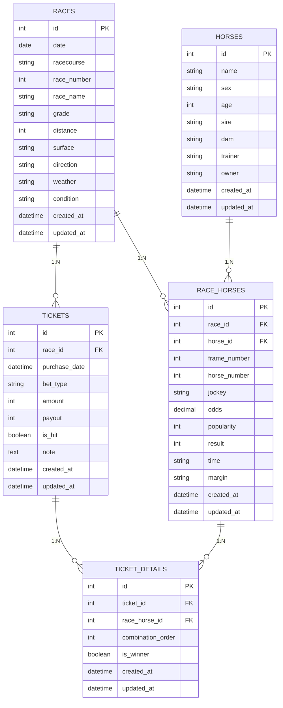

# 🏇 競馬購入馬券管理DB テーブル設計書

この設計は「馬券情報中心」で運用可能であり、将来的にレース・出走馬情報を追加できる柔軟な構成です。
馬券登録時はレースの基本情報（日付・競馬場・レース番号）のみを必須とし、詳細情報は任意で追加可能です。

---

## 📘 ER図（Mermaid記法）

---

## 🧩 テーブル定義一覧

### races（レース情報）

| カラム名 | 型 | NULL | 説明 |
|-----------|----|------|------|
| id | INTEGER | NO | レースID（PK） |
| date | DATE | NO | 開催日（必須） |
| racecourse | VARCHAR(50) | NO | 競馬場名（必須） |
| race_number | INTEGER | NO | レース番号（必須） |
| race_name | VARCHAR(100) | YES | レース名（任意） |
| grade | VARCHAR(10) | YES | 格付け（G1/G2/G3など、任意） |
| distance | INTEGER | YES | 距離（m、任意） |
| surface | VARCHAR(10) | YES | 芝・ダート（任意） |
| direction | VARCHAR(10) | YES | 左回り・右回り（任意） |
| weather | VARCHAR(10) | YES | 天候（任意） |
| condition | VARCHAR(10) | YES | 馬場状態（任意） |
| created_at | DATETIME | NO | 作成日時 |
| updated_at | DATETIME | NO | 更新日時 |

**制約:**
- UNIQUE(date, racecourse, race_number) - 同一レースの重複を防止

---

### horses（馬情報）

| カラム名 | 型 | NULL | 説明 |
|-----------|----|------|------|
| id | INTEGER | NO | 馬ID（PK） |
| name | VARCHAR(100) | NO | 馬名 |
| sex | VARCHAR(5) | YES | 性別（牡・牝・騸） |
| age | INTEGER | YES | 年齢 |
| sire | VARCHAR(100) | YES | 父馬 |
| dam | VARCHAR(100) | YES | 母馬 |
| trainer | VARCHAR(100) | YES | 調教師 |
| owner | VARCHAR(100) | YES | 馬主 |
| created_at | DATETIME | NO | 作成日時 |
| updated_at | DATETIME | NO | 更新日時 |

---

### race_horses（出走馬情報）

| カラム名 | 型 | NULL | 説明 |
|-----------|----|------|------|
| id | INTEGER | NO | 出走ID（PK） |
| race_id | INTEGER | YES | races.id |
| horse_id | INTEGER | YES | horses.id |
| frame_number | INTEGER | YES | 枠番 |
| horse_number | INTEGER | YES | 馬番 |
| jockey | VARCHAR(100) | YES | 騎手名 |
| odds | DECIMAL(5,2) | YES | 単勝オッズ |
| popularity | INTEGER | YES | 人気順 |
| result | INTEGER | YES | 着順 |
| time | VARCHAR(20) | YES | タイム |
| margin | VARCHAR(20) | YES | 着差 |
| created_at | DATETIME | NO | 作成日時 |
| updated_at | DATETIME | NO | 更新日時 |

---

### tickets（購入馬券）

| カラム名 | 型 | NULL | 説明 |
|-----------|----|------|------|
| id | INTEGER | NO | 馬券ID（PK） |
| race_id | INTEGER | NO | races.id（必須） |
| purchase_date | DATETIME | YES | 購入日時 |
| bet_type | VARCHAR(20) | YES | 馬券種別（単勝・馬連など） |
| amount | INTEGER | NO | 購入金額 |
| payout | INTEGER | YES | 払戻金額 |
| is_hit | BOOLEAN | YES | 的中フラグ |
| note | TEXT | YES | 備考・メモ |
| created_at | DATETIME | NO | 作成日時 |
| updated_at | DATETIME | NO | 更新日時 |

**制約:**
- FOREIGN KEY(race_id) REFERENCES races(id) - レース情報必須

---

### ticket_details（馬券の組み合わせ詳細）

| カラム名 | 型 | NULL | 説明 |
|-----------|----|------|------|
| id | INTEGER | NO | 明細ID（PK） |
| ticket_id | INTEGER | NO | tickets.id |
| race_horse_id | INTEGER | YES | race_horses.id（NULL可） |
| combination_order | INTEGER | YES | 組み合わせ順序 |
| is_winner | BOOLEAN | YES | 的中した組み合わせか |
| created_at | DATETIME | NO | 作成日時 |
| updated_at | DATETIME | NO | 更新日時 |

---

## 🔗 リレーションまとめ

| 親テーブル | 子テーブル | 関係 | 備考 |
|--------------|-------------|--------|------|
| races | race_horses | 1:N | レースごとの出走馬 |
| horses | race_horses | 1:N | 馬ごとの出走履歴 |
| races | tickets | 1:N | レースに対する購入馬券 |
| tickets | ticket_details | 1:N | 馬券の組み合わせ詳細 |
| race_horses | ticket_details | 1:N | 組み合わせが指す出走馬 |

---