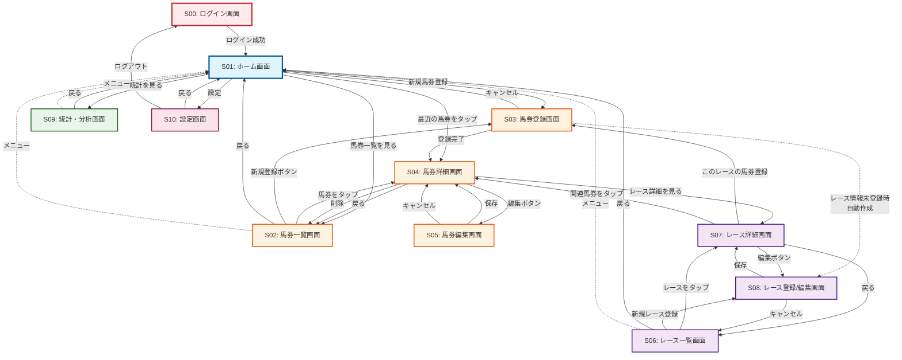
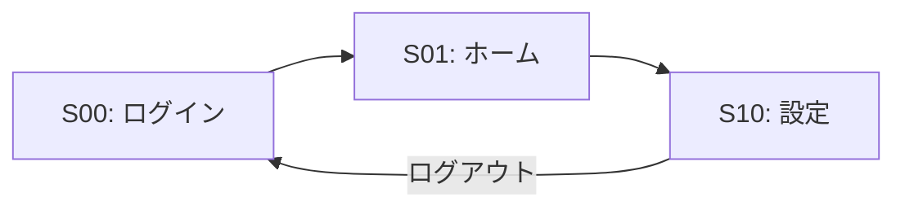
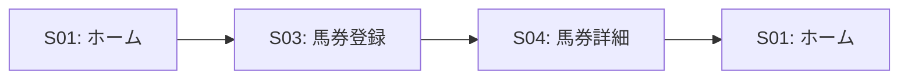
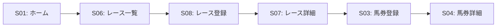
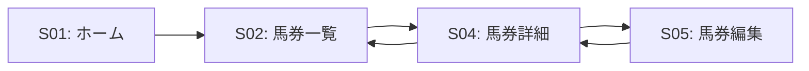
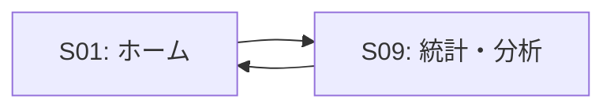
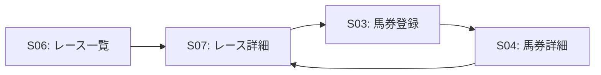
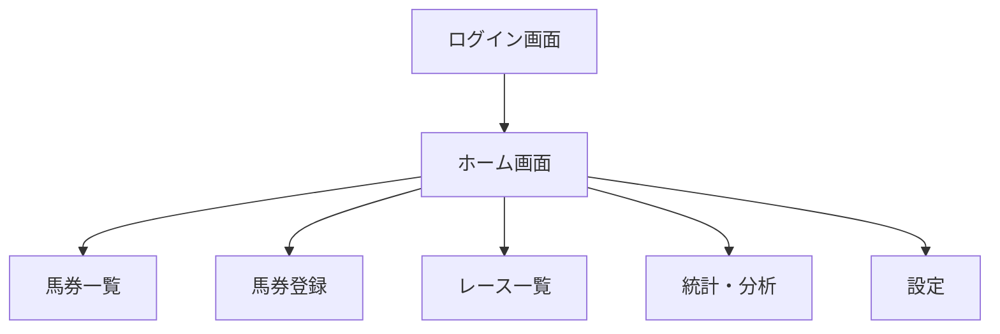
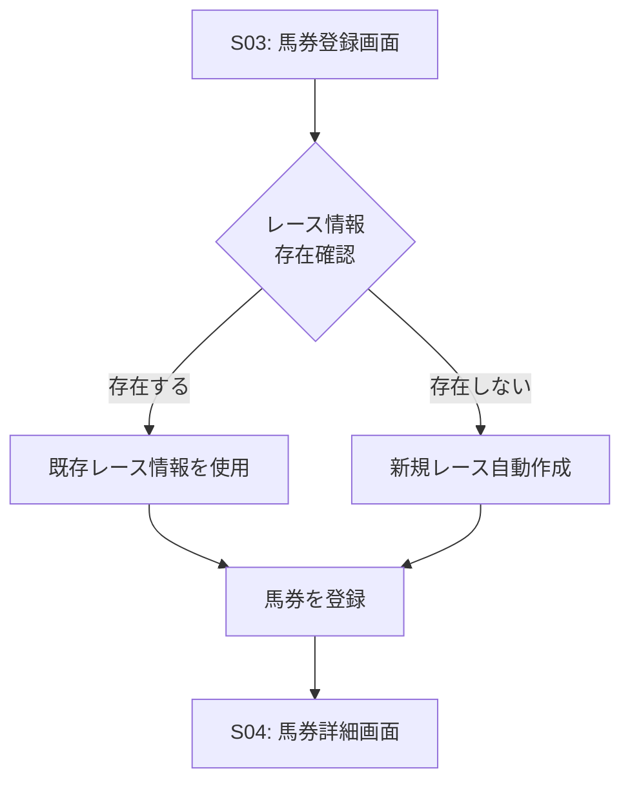

# 画面遷移図

## 画面遷移フロー

このドキュメントでは、競馬購入馬券管理システムの画面遷移を図示します。

---

## 📊 画面遷移図（Mermaid記法）



---

## 🗺️ 画面遷移パターン

### 0. ログインフロー

アプリ初回起動時、またはログアウト後の認証フローです。



**操作手順:**
1. アプリ起動時、ログイン画面を表示
2. メールアドレスとパスワードを入力
3. ログインボタンをタップ
4. 認証成功後、ホーム画面へ遷移
5. ログアウト時は設定画面からログイン画面へ戻る

**認証状態:**
- ログイン状態はトークンまたはセッションで管理
- 未ログイン時に認証が必要な画面にアクセスすると自動的にログイン画面へリダイレクト

---

### 1. 馬券登録フロー（基本）

最も一般的な利用フローです。



**操作手順:**
1. ホーム画面で「新規馬券登録」ボタンをタップ
2. レース情報と馬券情報を入力
3. 登録ボタンをタップ
4. 登録完了後、馬券詳細画面を表示
5. ホームに戻る

---

### 2. 馬券登録フロー（レース情報付き）

レース詳細を先に登録してから馬券を登録する場合のフローです。



**操作手順:**
1. レース一覧からレース登録画面へ
2. レース情報と出走馬情報を入力
3. レース詳細画面で「馬券登録」ボタンをタップ
4. 馬券情報を入力（レース情報は自動入力される）
5. 登録完了

---

### 3. 馬券編集フロー

登録済みの馬券に払戻金額などを追加する場合のフローです。



**操作手順:**
1. ホーム画面から馬券一覧へ
2. 編集したい馬券をタップ
3. 馬券詳細画面で「編集」ボタンをタップ
4. 払戻金額やメモを入力
5. 保存して詳細画面に戻る

---

### 4. 統計確認フロー

収支や傾向を確認する場合のフローです。



**操作手順:**
1. ホーム画面で「統計を見る」をタップ
2. 期間や馬券種別でフィルタリング
3. グラフや数値で収支を確認
4. ホームに戻る

---

### 5. レース詳細から馬券登録フロー

レース詳細画面から直接馬券を登録する場合のフローです。



**操作手順:**
1. レース一覧から該当レースをタップ
2. レース詳細画面で出走馬情報を確認
3. 「このレースの馬券を登録」ボタンをタップ
4. 馬券情報を入力（レース情報は自動入力）
5. 登録完了後、馬券詳細を表示
6. レース詳細に戻る

---

## 🧭 ナビゲーション構造

### メインナビゲーション

アプリケーションの主要な画面へはログイン後、ホーム画面を経由してアクセスします。



### グローバルナビゲーション

一部の画面からは、メニューボタンでホーム画面にいつでも戻ることができます。

**グローバルナビゲーション対象画面:**
- 馬券一覧画面
- レース一覧画面
- 統計・分析画面

---

## 🔄 遷移パターンの分類

### 1. 階層型遷移

親子関係が明確な画面遷移です。

```
ホーム → 馬券一覧 → 馬券詳細 → 馬券編集
```

戻るボタンで1つ前の画面に戻ります。

### 2. 並列型遷移

ホーム画面から各機能画面への遷移です。

```
ホーム ⇄ 馬券一覧
ホーム ⇄ レース一覧
ホーム ⇄ 統計・分析
ホーム ⇄ 設定
```

### 3. クロス遷移

異なる機能間の遷移です。

```
馬券詳細 → レース詳細
レース詳細 → 馬券登録
```

関連する情報に素早くアクセスできるようにします。

---

## 📱 モバイル対応の考慮事項

### 戻るボタンの配置

- iOS: 左上に戻るボタン
- Android: システムの戻るボタンとアプリ内の戻るボタンを併用

### スワイプジェスチャー

- 一覧画面: 左スワイプで削除、右スワイプで編集
- 詳細画面: 右スワイプで前画面に戻る

### ボトムナビゲーション（オプション）

主要な画面へのクイックアクセスとして、ボトムナビゲーションの実装を検討：

```
[ホーム] [馬券一覧] [新規登録] [統計] [設定]
```

---

## 🎯 画面遷移設計の原則

### 1. セキュアな認証

未ログイン時は認証が必要な画面にアクセスできず、自動的にログイン画面へリダイレクト。

### 2. 最小ステップの原則

よく使う機能（馬券登録）はホーム画面から1タップでアクセス可能。

### 3. 明確な戻り先

どの画面からも、戻るボタンで直前の画面に戻れる。

### 4. コンテキストの維持

関連情報間の遷移をスムーズに（例: 馬券詳細 ⇄ レース詳細）。

### 5. 迷子にならない設計

深い階層に入っても、常にホームに戻る手段を提供。

### 6. データの整合性

レース情報が未登録の場合は自動的に作成し、ユーザーの手間を削減。

---

## 🔍 特殊な遷移パターン

### レース自動作成

馬券登録時にレース情報が存在しない場合の処理フロー：



**処理内容:**
1. 日付・競馬場・レース番号の組み合わせでレースを検索
2. 存在すればそのレースIDを使用
3. 存在しなければ最低限の情報でレースレコードを自動作成
4. 作成されたレースIDで馬券を登録

---

**最終更新:** 2025-10-19
